<div align="center">

# 🧠 BuzzArena: Multiplayer Real-Time Trivia

### Thousands of players. One question. Ten seconds. Every answer judged fairly.

A live quiz show where every question reaches every phone at the same moment, answers are judged by the server clock, and the game keeps going when the server running it dies in the middle of a question.<br/>
The last project of the series: **WebSockets, consensus, leader election, fencing tokens, failover, authentication, authorization, encryption and observability**, together with everything from Projects 1-4.


-419EDA?logo=etcd&logoColor=white)


**[▶ Watch the demo](#-demo)** · **[🏗️ Architecture](#4-high-level-architecture)** · **[🧪 Try the demos](#-run-the-demos)** · **[🚀 Run it](#16-how-to-run)**

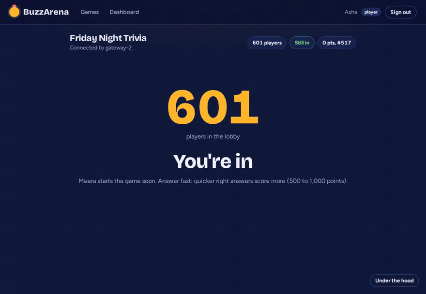

<sub>Asha and 600 other players. The countdown ring runs on the server's clock; she taps B, the reveal shows 74% chose the right answer, then the standings. Shown at about 2× speed.</sub>

</div>

---

## 🎬 Demo

<div align="center">

<a href="docs/demo/full-demo.mp4">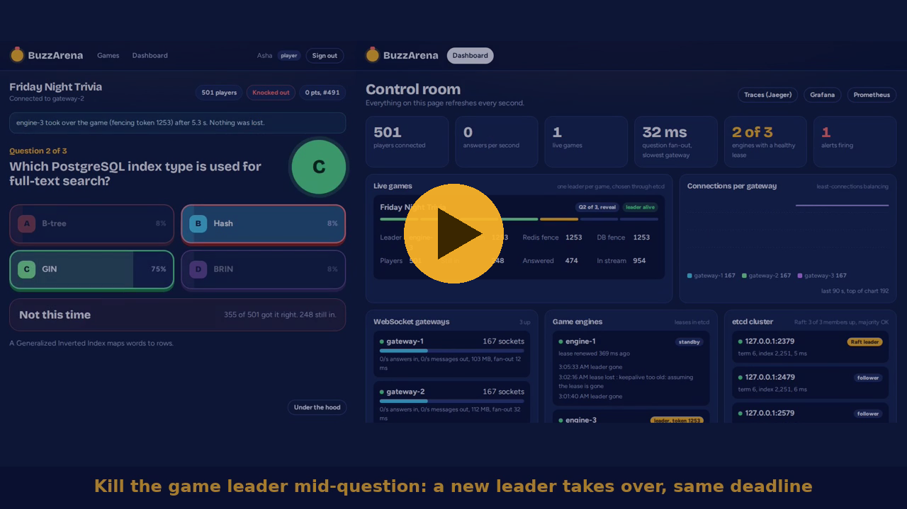</a>

**[▶ Watch the full demo video (2 min 18 s)](docs/demo/full-demo.mp4)**<br/>
<sub>A live game · the host console · killing the leader mid-question · the zombie leader · a gateway crash · the control room during chaos · etcd losing its majority · one answer traced · attacks</sub>

</div>

| Demo | What it shows |
|---|---|
| [🎮 A live game](#-demo) (above) | 600 players, questions on every screen at once, server-clock countdown, reveal, standings |
| [👑 Kill the leader mid-question](#87-failover-resuming-in-the-middle-of-a-question) | The engine running the game is killed with 6 s left. Another takes over; the question keeps its deadline; 173 answers sent while there was **no leader** all count. |
| [🧟 The zombie leader](#86-fencing-tokens-and-the-zombie-leader) | A frozen leader wakes up still thinking it leads. Its old fencing token is rejected. |
| [🔌 Kill a WebSocket gateway](#88-reconnect-and-resume) | 500 players lose their connection, reconnect elsewhere and resume: 0 missed messages |
| [🗳️ etcd loses its majority](#813-cap-again-when-etcd-loses-its-majority) | The game pauses instead of risking two leaders, and resumes on its own |
| [🔍 One answer, one trace](#812-observability-metrics-logs-traces-alerts) | An answer followed through gateway → Redis → leader engine in Jaeger, with its logs from Loki |
| [🛡️ Attack it](#89-authentication) | Forged tokens, a stolen refresh token, replayed tickets, cross-site WebSockets, cheating |
| [📊 3,000 players with chaos](#9-live-dashboard) | The control room while the leader and a gateway are killed during a game |

---

## 🧠 What you will learn from this project

| Concept | Where it shows up |
|---|---|
| ✅ WebSockets at scale: tickets, heartbeats, backpressure, balancing long-lived connections | [8.1](#81-websockets-at-scale) |
| ✅ Fan-out: one message to thousands of sockets through pub/sub | [8.2](#82-fan-out-one-message-to-every-player) |
| ✅ Fairness with clocks: server time, clock sync, deadlines, "first answer wins" | [8.3](#83-fair-timing-the-server-clock-decides) |
| ✅ Absorbing a burst with a stream and a consumer group | [8.4](#84-the-answer-burst-a-redis-stream) |
| ✅ Consensus basics (Raft) and leader election with leases | [8.5](#85-consensus-and-leader-election-with-etcd) |
| ✅ Fencing tokens: stopping a stale "zombie" leader | [8.6](#86-fencing-tokens-and-the-zombie-leader) |
| ✅ Fault tolerance and failover of a *stateful* process, mid-task | [8.7](#87-failover-resuming-in-the-middle-of-a-question) |
| ✅ Reconnect and resume with sequence numbers | [8.8](#88-reconnect-and-resume) |
| ✅ Authentication: argon2id, Ed25519 JWTs, JWKS, refresh-token rotation with theft detection | [8.9](#89-authentication) |
| ✅ Authorization: roles plus ownership | [8.10](#810-authorization-roles-and-ownership) |
| ✅ Encryption in transit and at rest, key rotation | [8.11](#811-encryption-in-transit-and-at-rest) |
| ✅ Monitoring, logging, metrics, distributed tracing, alerting | [8.12](#812-observability-metrics-logs-traces-alerts) |
| ✅ CAP in practice: pausing instead of guessing | [8.13](#813-cap-again-when-etcd-loses-its-majority) |

---

## 📚 Part of a 5-project System Design series

| # | Project | Focus | Status |
|---|---------|-------|--------|
| 1 | Live Event Ticketing & Seat Reservation | Handle traffic: load balancing, caching, rate limiting, API design | ✅ Done |
| 2 | Collaborative Polling & Live Voting | Handle distributed data: SQL vs NoSQL, indexing, replication, sharding, CAP | ✅ Done |
| 3 | Food Delivery Order Orchestration | Handle distributed services: queues, Kafka/RabbitMQ, pub-sub, microservices | ✅ Done |
| 4 | Podcast / Audio Streaming Platform | Handle large-scale storage & delivery: object storage, CDN, feeds, fan-out | ✅ Done |
| **5** | **Multiplayer Real-Time Trivia** *(this repo)* | Bring it together: WebSockets, failover, leader election, auth, observability | ✅ Done |

**What carries over, project by project:**

| From | Reused here |
|---|---|
| **Project 1** (traffic) | Nginx in front of stateless servers, least-connections balancing, per-IP limits at the edge and per-user token buckets (Redis Lua), "one seat, one booking" becomes "one answer per player per question" |
| **Project 2** (data) | PostgreSQL primary + read replica for history and results, uniqueness as idempotency, choosing consistency or availability per kind of data; Server-Sent Events grow up into WebSockets |
| **Project 3** (services) | Separate services from one image, a stream with a consumer group for the burst, idempotent consumers, "at least once" plus de-duplication |
| **Project 4** (delivery) | Fan-out thinking: push once per gateway, not once per player; keep hot state in Redis, durable state in PostgreSQL |

The earlier READMEs each listed "leader election, WebSockets, observability: Project 5" under their limitations. This is where those get built.

---

## Table of contents

1. [Problem Statement](#1-problem-statement)
2. [Requirements](#2-requirements)
3. [Capacity Estimation](#3-capacity-estimation)
4. [High-Level Architecture](#4-high-level-architecture)
5. [Screens Tour](#5-screens-tour)
6. [Data Design](#6-data-design)
7. [API and Message Design](#7-api-and-message-design)
8. [Deep Dives](#8-deep-dives)
9. [Live Dashboard](#9-live-dashboard)
10. [Failure Scenarios](#10-failure-scenarios)
11. [Trade-offs & Alternatives Considered](#11-trade-offs--alternatives-considered)
12. [Load Test Results](#12-load-test-results)
13. [Limitations & What I'd Do Differently](#13-limitations--what-id-do-differently)
14. [Tech Stack](#14-tech-stack)
15. [Project Structure](#15-project-structure)
16. [How to Run](#16-how-to-run)

---

## 1. Problem Statement

It's 9:00 PM. The host presses **Start**. 50,000 players are connected. Question 1 appears on every screen and a 10-second countdown starts. Almost everyone taps an answer, and most of them tap in the last three seconds.

Every earlier project answered requests. Here the **server** has to talk first, to everyone, at the same moment, and one process has to be in charge of each game:

| Problem | What it means |
|---|---|
| 🔌 **Connections live for the whole game** | 50,000 phones each hold one open connection for 20 minutes. Servers now have state: *who is connected to me*. |
| 📢 **One message to everyone, at once** | A question that reaches some players 2 seconds late is not a fair question. |
| ⏱️ **Time is the rule** | "Answered in time" must be decided by the server. Phone clocks are wrong, sometimes by minutes. |
| 🌊 **Answers arrive as a burst** | 50,000 answers in 10 seconds, bunched at the end: over 10,000 per second at the peak. |
| 👑 **Exactly one game master** | Something must run each game's timer and scoring. Two of them would send two different questions. |
| 💥 **It will crash mid-question** | The game master can die at second 6 of question 3. The game must continue from second 6: not restart, not freeze. |
| 🧟 **"Dead" servers come back** | A server that froze for 10 seconds wakes up still believing it is in charge. It must not be able to do damage. |
| 🕵️ **People cheat** | The right answer must never reach a phone before the deadline; tokens must not be forged or stolen and reused. |
| 🔍 **"Why didn't my answer count?"** | Across 10+ processes, you need to answer that in seconds, from metrics, logs and traces. |

**The goal:** real time, fair, and never interrupted for long by any single failure, with every decision visible.

## 2. Requirements

### What the system must do (functional requirements)

- 🔐 Sign up and sign in; stay signed in safely (short access tokens, rotating refresh tokens).
- 🎤 Hosts create games from question packs and start them; they see the live split of answers.
- 🎮 Players join a lobby before the start; later arrivals can watch but not play.
- ❓ Each question is shown to everyone at once with a countdown; players answer once.
- ✅ After the deadline: the right answer, how everyone answered, your points, your rank.
- 🏆 Faster right answers score more (500 to 1,000 points). A wrong or missing answer knocks you out of "still in", but you keep playing for points.
- 📜 Final results, your history and an all-time leaderboard.
- 🛠️ Admins manage roles, the question bank and signing keys; everything security-related is audited.

### How well it must do it (non-functional requirements)

| Requirement | Target | How we achieve it |
|---|---|---|
| **Fan-out** | A question reaches every player within a few hundred ms | Redis pub/sub to gateways, each writes to its own sockets ([8.2](#82-fan-out-one-message-to-every-player)) |
| **Fairness** | The same deadline for everyone, decided by the server | Server time stamps, client clock sync, a small grace period ([8.3](#83-fair-timing-the-server-clock-decides)) |
| **No lost answers** | An acknowledged answer is always counted | Redis Stream + consumer group; acknowledgement only after the write ([8.4](#84-the-answer-burst-a-redis-stream)) |
| **One leader per game** | Never two game masters, even during failures | etcd leases + Raft majority + fencing tokens ([8.5](#85-consensus-and-leader-election-with-etcd), [8.6](#86-fencing-tokens-and-the-zombie-leader)) |
| **Failover** | A crashed leader is replaced in about 5 s; the game resumes mid-question | Checkpoint in Redis written atomically with every message ([8.7](#87-failover-resuming-in-the-middle-of-a-question)) |
| **Survive a gateway crash** | Players reconnect and miss nothing | Sequence numbers + a replay log ([8.8](#88-reconnect-and-resume)) |
| **Security** | No early answers, no forged or stolen sessions | Ed25519 JWTs, refresh rotation, one-time WS tickets, TLS, encrypted answers ([8.9](#89-authentication)-[8.11](#811-encryption-in-transit-and-at-rest)) |
| **Observability** | Explain any answer in seconds | Metrics, JSON logs with trace ids, distributed traces, alerts ([8.12](#812-observability-metrics-logs-traces-alerts)) |

## 3. Capacity Estimation

> [!NOTE]
> Rough math before building, then checked against the load test ([12](#12-load-test-results)).

A national live quiz: **50,000 players** in one game, 12 questions of 10 seconds.

| What | Math | Result |
|---|---|---|
| Open WebSockets | 50,000 players | 50,000 connections to the gateways, 50,000 more from Nginx to the gateways |
| Memory per connection | measured: ~280 MB per gateway with 3,333 sockets, ~100 MB of it Node itself | **~55 KB per socket** → 50,000 sockets ≈ **2.8 GB** of gateway memory, e.g. 4-6 gateways of ~10,000 each |
| One question, sent to everyone | 50,000 × ~400 bytes | **~20 MB** leaving the gateways within a few hundred ms |
| Answers | 50,000 × 96% answering, ~60% of them in the last 3 s | **~10,000-15,000 answers/s** at the peak |
| Redis work per answer | 1 stream write + 1 "first answer wins" write | **~30,000 simple operations/s** at the peak: one Redis handles this |
| Personal results after each reveal | 50,000 × (points, score, rank, still-in) | **200,000 reads**, pipelined 500 players per round trip: ~100 round trips |
| Heartbeats | 50,000 ÷ one ping every 25 s | 2,000 pings/s, handled by the gateways alone |
| etcd | 1 lease renewal per engine every ~1.7 s + 1 write per election | Tiny. etcd is for **agreement**, not for traffic. |

> [!IMPORTANT]
> **The key ideas:** keep the WebSocket servers dumb and replaceable (they only relay); put the one thing that must be unique, the game leader, behind consensus; and make every write from that leader carry a token, so being wrong about who leads can never corrupt a game.

This repository runs the same design on a laptop: 3 gateways, 3 engines, 3 etcd members, and a bot swarm of up to **10,000 real WebSocket players** going through Nginx and TLS.

## 4. High-Level Architecture

<div align="center">
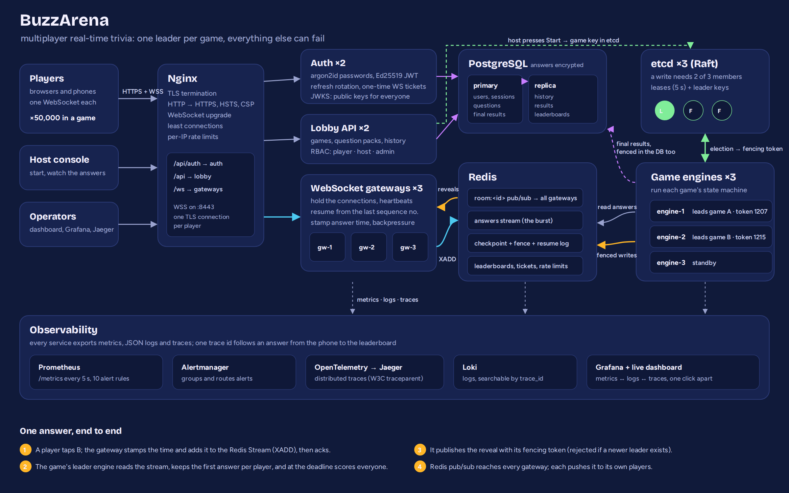
</div>

### What each part does, in simple words

| Part | Its job | Why it's there |
|---|---|---|
| 🌐 **Nginx** | TLS for everything (HTTPS and WSS), redirects HTTP, security headers, WebSocket upgrade, least-connections balancing, per-IP limits | One front door; long-lived connections are balanced by *count*, not by request |
| 🔐 **Auth ×2** | argon2id passwords, 15-minute Ed25519 JWTs, rotating refresh tokens, one-time WebSocket tickets, the public keys (JWKS) | Everyone else verifies tokens with the public keys, so a running game does not need the auth service |
| 🗂️ **Lobby API ×2** | Games, question packs, host controls, history, admin, the dashboard data | Ordinary stateless REST with role-based access control |
| 🔌 **WebSocket gateways ×3** | Hold player connections; copy room messages to their own sockets; stamp and forward answers; replay missed messages | They know *who is connected*, not *how the game works*, so any of them can die |
| 🧠 **Game engines ×3** | Compete through etcd to lead games; the leader runs the game: timer, questions, scoring, results | The only place with game logic; exactly one leader per game |
| 🗳️ **etcd ×3** | Consensus with Raft: leases, leader keys, the list of games needing a leader | A write needs 2 of 3 members, so two engines can never both win |
| ⚡ **Redis** | Room pub/sub, the answer stream, checkpoints and fences, resume logs, leaderboards, tickets, rate limits | Fast shared state that makes gateways and engines replaceable |
| 🐘 **PostgreSQL + replica** | Users, sessions, questions (answers encrypted), games, final results, audit log | The durable truth; the replica serves history and leaderboards |
| 🔭 **Prometheus, Alertmanager, Loki, Jaeger (via OpenTelemetry), Grafana** | Metrics, alerts, logs, traces, dashboards | You cannot run what you cannot see |

### One answer, from tap to leaderboard

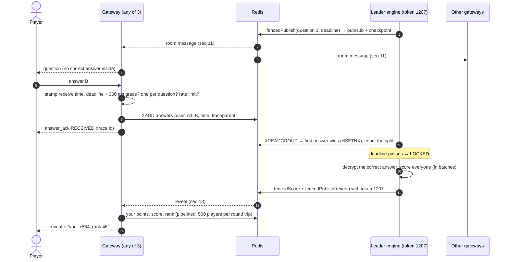
```mermaid
sequenceDiagram
    autonumber
    actor P as Player
    participant G as Gateway (any of 3)
    participant R as Redis
    participant E as Leader engine (token 1207)
    participant O as Other gateways

    E->>R: fencedPublish(question 3, deadline) → pub/sub + checkpoint
    R-->>G: room message (seq 11)
    R-->>O: room message (seq 11)
    G-->>P: question (no correct answer inside)
    P->>G: answer B
    G->>G: stamp receive time, deadline + 300 ms grace? one per question? rate limit?
    G->>R: XADD answers {user, q3, B, time, traceparent}
    G-->>P: answer_ack RECEIVED (trace id)
    E->>R: XREADGROUP → first answer wins (HSETNX), count the split
    Note over E: deadline passes → LOCKED
    E->>E: decrypt the correct answer, score everyone (in batches)
    E->>R: fencedScore + fencedPublish(reveal) with token 1207
    R-->>G: reveal (seq 13)
    G->>R: your points, score, rank (pipelined, 500 players per round trip)
    G-->>P: reveal + "you: +864, rank 46"
```

### The game, as a state machine

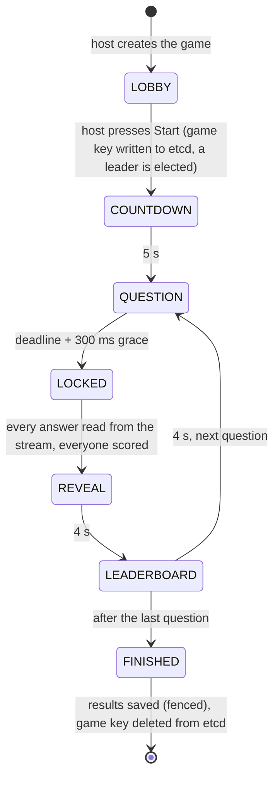
```mermaid
stateDiagram-v2
    [*] --> LOBBY: host creates the game
    LOBBY --> COUNTDOWN: host presses Start (game key written to etcd, a leader is elected)
    COUNTDOWN --> QUESTION: 5 s
    QUESTION --> LOCKED: deadline + 300 ms grace
    LOCKED --> REVEAL: every answer read from the stream, everyone scored
    REVEAL --> LEADERBOARD: 4 s
    LEADERBOARD --> QUESTION: 4 s, next question
    LEADERBOARD --> FINISHED: after the last question
    FINISHED --> [*]: results saved (fenced), game key deleted from etcd
```

Every arrow is one call to a Lua script that **checks the fencing token, publishes the message and saves the checkpoint in one step**. That checkpoint is what a new leader resumes from.

## 5. Screens Tour

| Sign in (demo accounts one click away) | Tonight's games: one on air, others waiting |
|---|---|
| 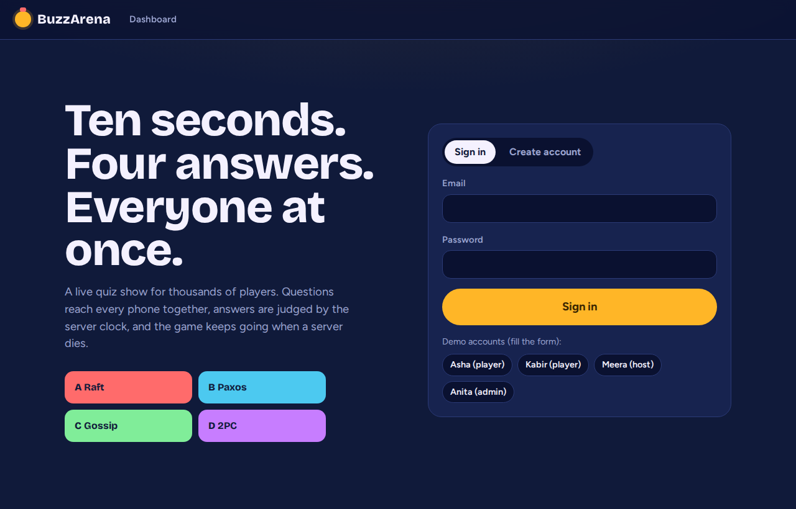 | 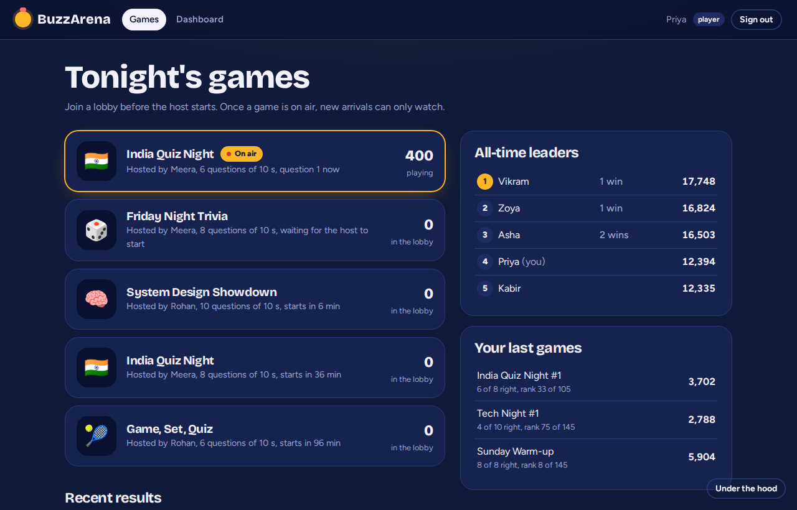 |
| **The lobby of a game**: 802 players waiting | **A question**: four podium buttons and a server-clock countdown |
| 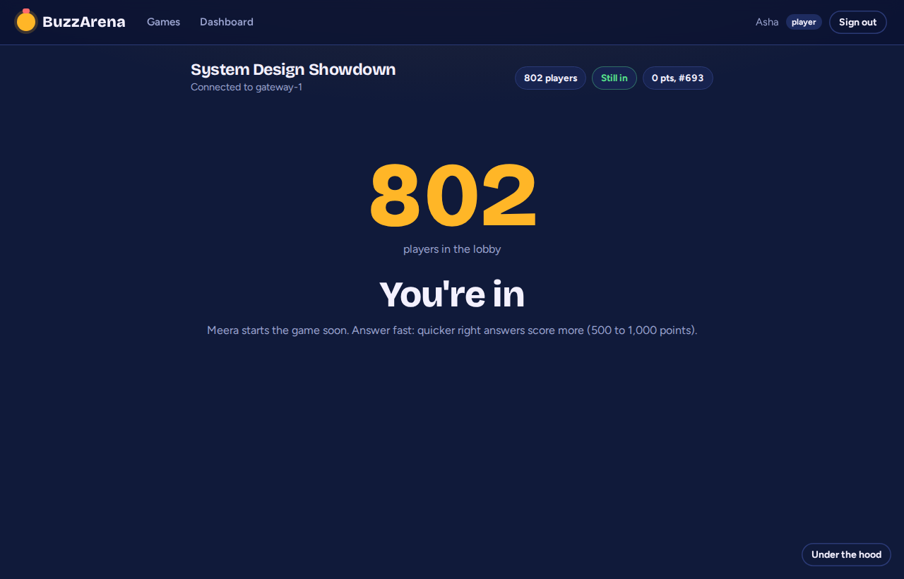 | 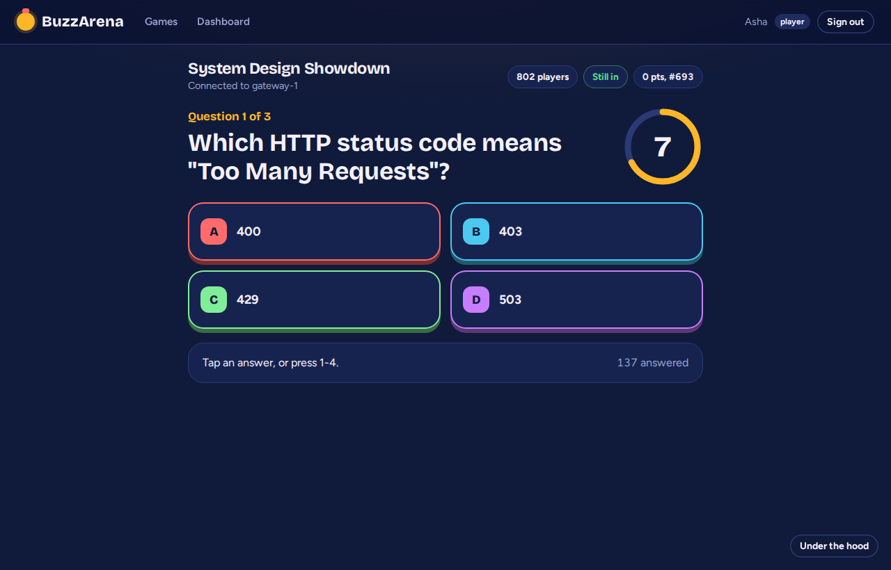 |
| **The reveal**: the right answer, the split, your points | **Standings** after each question |
| 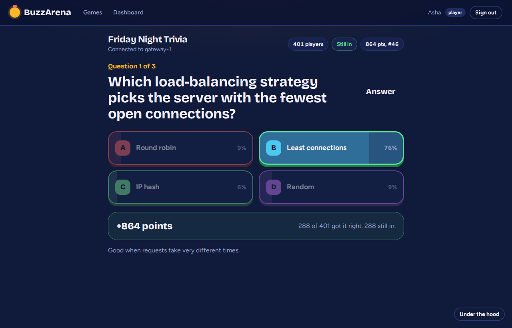 | 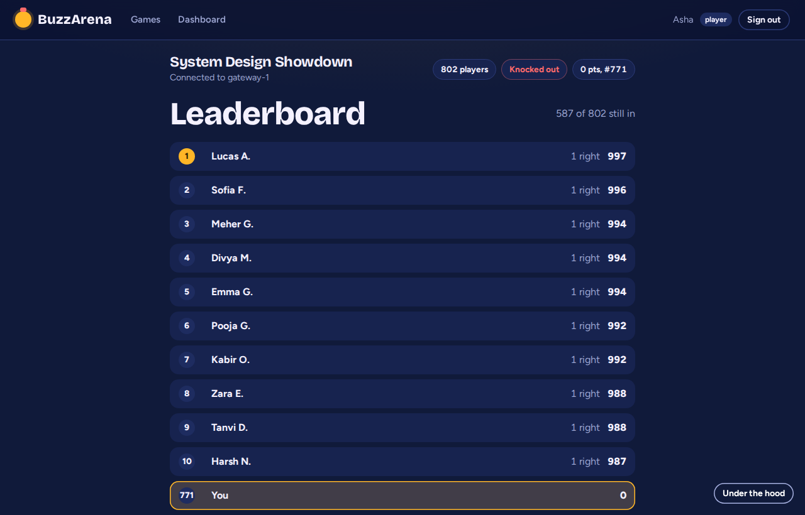 |
| **Final results** with the podium | **Host console**: the answer (hosts may see it), the live split, the leader and its token |
| 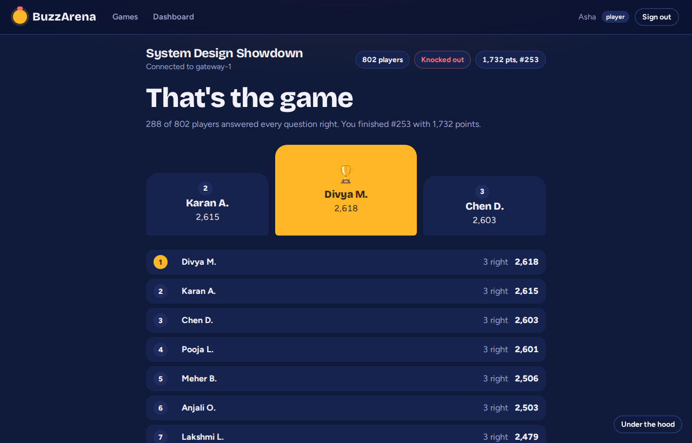 | 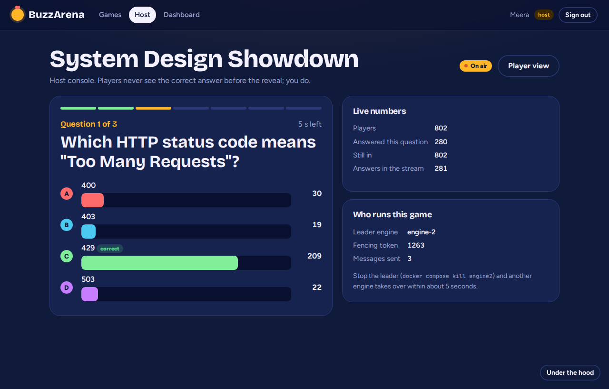 |
| **Admin**: roles, the security log, the encrypted question bank | **Mobile** |
| 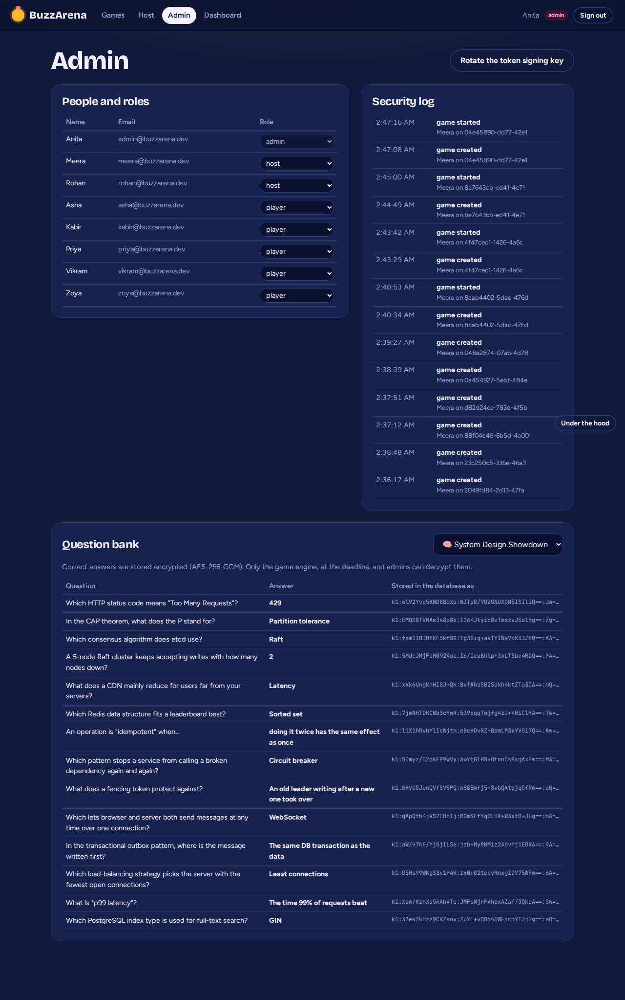 | 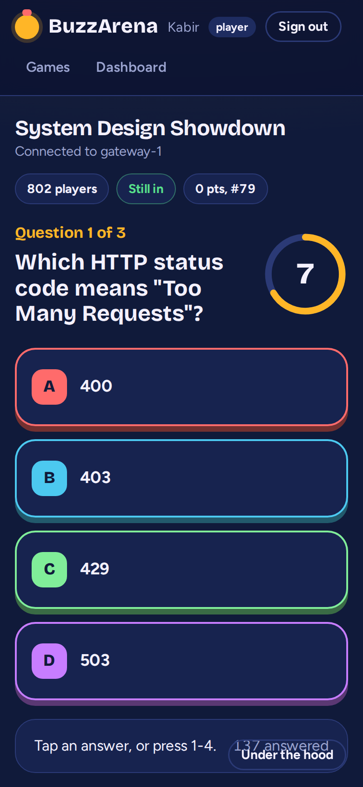 |

<div align="center">
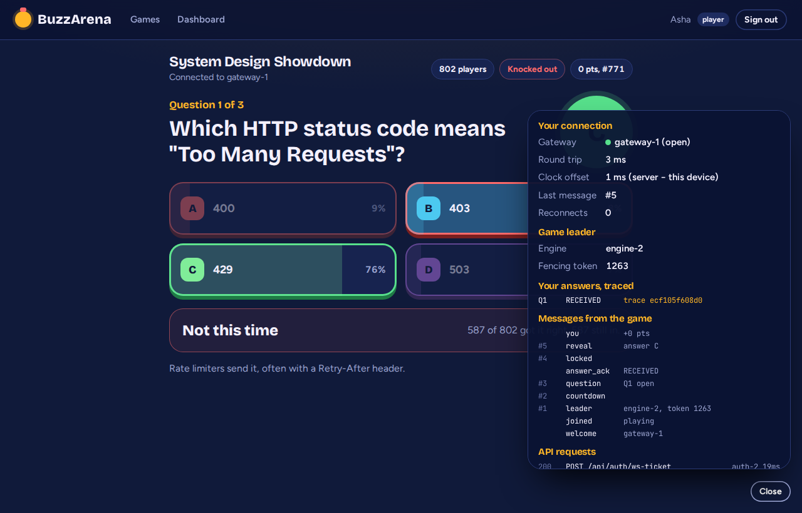
<br/><sub>The <b>"Under the hood"</b> panel on every page: which gateway you are on, your round trip and clock offset, the last sequence number, the current leader and its fencing token, your answers with links to their traces, every message from the game, and which server answered each API call.</sub>
</div>

## 6. Data Design

### Where each kind of data lives

| Data | Store | Why |
|---|---|---|
| Users, refresh tokens (hashed), signing keys (encrypted), audit log | **PostgreSQL** | Durable, relational, needs transactions |
| Questions with the correct answer **encrypted** | **PostgreSQL** | Only the engine at the deadline and admins can decrypt it |
| Games and final results | **PostgreSQL** primary → **replica** for reads | Written once per game; read often (history, leaderboards) |
| Live game: checkpoint, fence, sequence number, resume log | **Redis** | Written on every step, read by a new leader on takeover |
| Answers (the burst) | **Redis Stream** + consumer group | Absorbs thousands per second; nothing lost if the reader dies |
| Leaderboard, "still in", points per question | **Redis** sorted set, sets, hashes | `ZINCRBY` and `ZREVRANK` are what a leaderboard needs |
| Who leads which game; which games need a leader | **etcd** | Must be agreed by a majority; tiny |

### PostgreSQL

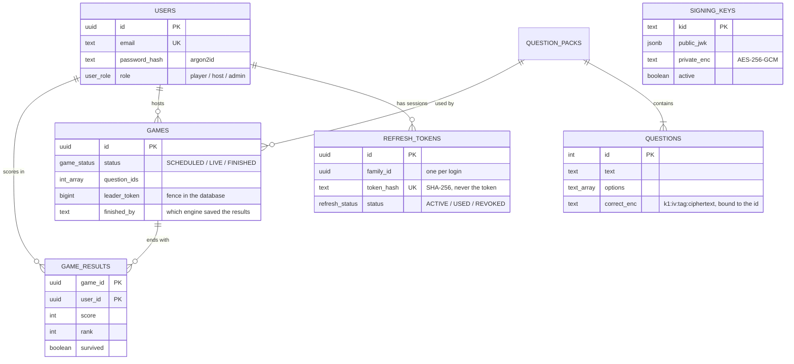
```mermaid
erDiagram
    USERS ||--o{ REFRESH_TOKENS : "has sessions"
    USERS ||--o{ GAMES : hosts
    QUESTION_PACKS ||--|{ QUESTIONS : contains
    QUESTION_PACKS ||--o{ GAMES : "used by"
    GAMES ||--o{ GAME_RESULTS : "ends with"
    USERS ||--o{ GAME_RESULTS : "scores in"
    USERS {
        uuid id PK
        text email UK
        text password_hash "argon2id"
        user_role role "player / host / admin"
    }
    REFRESH_TOKENS {
        uuid id PK
        uuid family_id "one per login"
        text token_hash UK "SHA-256, never the token"
        refresh_status status "ACTIVE / USED / REVOKED"
    }
    SIGNING_KEYS {
        text kid PK
        jsonb public_jwk
        text private_enc "AES-256-GCM"
        boolean active
    }
    QUESTIONS {
        int id PK
        text text
        text_array options
        text correct_enc "k1:iv:tag:ciphertext, bound to the id"
    }
    GAMES {
        uuid id PK
        game_status status "SCHEDULED / LIVE / FINISHED"
        int_array question_ids
        bigint leader_token "fence in the database"
        text finished_by "which engine saved the results"
    }
    GAME_RESULTS {
        uuid game_id PK
        uuid user_id PK
        int score
        int rank
        boolean survived
    }
```

Full schema: [`db/schema.sql`](db/schema.sql).

### Redis keys for one game

```text
game:<id>:state        hash    phase, q, openedAt, deadline, phaseEndsAt, seq, leader, token, beat   ← the checkpoint
game:<id>:fence        string  the highest fencing token that has written                           ← the fence
game:<id>:seq          counter message sequence numbers
game:<id>:log          stream  the last 500 room messages, with their sequence numbers as ids      ← for resume
room:<id>              pub/sub every room message, to every gateway with players in this game
game:<id>:answers      stream  { user, q, choice, receivedAt, gateway, traceparent }  + group "engine"
game:<id>:q:<n>:answers hash   user → "choice|time"   (HSETNX: the first answer wins)
game:<id>:q:<n>:points hash    user → points           (HSETNX: scoring can be redone safely)
game:<id>:lb           zset    user → score
game:<id>:players / alive / names / correct            who joined, who is still in, display names, right answers
```

### etcd keys

```text
/buzzarena/games/<gameId>     { title, startedBy }     put by the lobby on Start, deleted by the leader at the end
/buzzarena/leaders/<gameId>   "engine-2"               created in a transaction, attached to engine-2's lease
                                                       its create revision (e.g. 1207) is the FENCING TOKEN
```

## 7. API and Message Design

### REST (all through Nginx on `https://localhost:8443`)

✅ = needs `Authorization: Bearer <access token>`. 🎤 = host or admin. 🛠️ = admin.

| Method | Endpoint | Who | What it does |
|---|---|---|---|
| `POST` | `/api/auth/signup` · `/login` | – | Create an account / sign in → access token + HttpOnly refresh cookie |
| `POST` | `/api/auth/refresh` | cookie | New access token; **rotates** the refresh token; reuse of an old one revokes the session family |
| `POST` | `/api/auth/logout` | cookie | Revoke the session family |
| `POST` | `/api/auth/ws-ticket` | ✅ | One-time, 30-second ticket to open a WebSocket |
| `GET` | `/api/auth/.well-known/jwks.json` | – | Public keys (Ed25519) for verifying tokens |
| `POST` | `/api/auth/keys/rotate` | 🛠️ | New signing key; old public keys stay published for a day |
| `GET` | `/api/games` · `/api/games/:id` | – | Games with live player counts and phase |
| `POST` | `/api/games` | 🎤 | Create a game from a pack |
| `POST` | `/api/games/:id/start` · `/cancel` | 🎤 owner | Start (writes the game to etcd) / cancel |
| `GET` | `/api/games/:id/host` | 🎤 owner | Host console: current question **with** its answer, live split |
| `GET` | `/api/games/:id/results` | – | Final results (from the replica) |
| `GET` | `/api/me/history` · `/api/leaderboard` | ✅ / – | Your games / all-time leaders (replica) |
| `GET` | `/api/packs` · `/api/packs/:id/questions` | – / 🛠️ | Packs / the question bank with decrypted answers |
| `GET` `PATCH` | `/api/admin/users` · `/api/admin/users/:id/role` · `/api/admin/audit` | 🛠️ | Roles and the security log |
| `GET` | `/api/ops/overview` | – | Everything the live dashboard shows |

Errors always look the same: `{ "error": { "code": "NOT_YOUR_GAME", "message": "Only the host of this game can do that" } }`. Codes include `UNAUTHORIZED`, `TOKEN_REUSED`, `ROLE_REQUIRED`, `NOT_YOUR_GAME`, `EMAIL_TAKEN`, `RATE_LIMITED` (with `Retry-After`) and `COORDINATION_UNAVAILABLE` (etcd has no majority). Responses carry `X-Served-By`, `X-Request-Id`, `X-Trace-Id` and, for replica reads, `X-Read-From`.

### WebSocket: `wss://localhost:8443/ws?ticket=<one-time ticket>`

| Direction | Message | Meaning |
|---|---|---|
| → | `{ type: "join", gameId, lastSeq }` | Join a game; `lastSeq > 0` means "I was here, send me what I missed" |
| → | `{ type: "answer", gameId, q, choice }` | One answer; the gateway stamps the time it arrived |
| → | `{ type: "ping", t0 }` | Clock sync; the reply carries the server time |
| ← | `welcome` · `joined` · `pong` | Which gateway you are on; your state in the game (score, rank, player or spectator) |
| ← | `leader` **seq** | Who leads the game now, their fencing token, and (after a failover) how long the silence was |
| ← | `countdown` · `question` · `locked` · `reveal` · `leaderboard` · `finished` **seq** | Room messages, numbered 1, 2, 3… so gaps are detectable |
| ← | `tally` · `presence` | Live counts. No sequence number: they may be dropped when a phone is slow. |
| ← | `answer_ack` | `RECEIVED` (with a trace id), `ALREADY_ANSWERED`, `TOO_LATE`, `NOT_OPEN`, `SPECTATOR`, `RATE_LIMITED` |
| ← | `you` | Your own result after each reveal: points, right or wrong, score, rank, still in |

## 8. Deep Dives

### 8.1 WebSockets at scale

> [!NOTE]
> **In simple words:** a WebSocket is a phone call instead of a letter. The browser rings once (an HTTP request asking to "upgrade"), and the line stays open so either side can talk at any time. The hard part is not one call; it's 50,000 calls that stay open for 20 minutes.

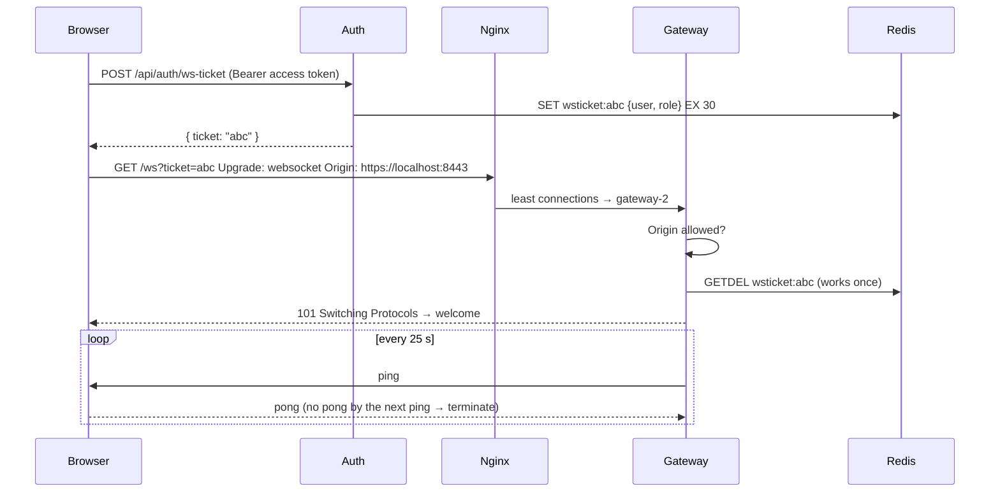
```mermaid
sequenceDiagram
    participant B as Browser
    participant A as Auth
    participant N as Nginx
    participant G as Gateway
    participant R as Redis
    B->>A: POST /api/auth/ws-ticket (Bearer access token)
    A->>R: SET wsticket:abc {user, role} EX 30
    A-->>B: { ticket: "abc" }
    B->>N: GET /ws?ticket=abc  Upgrade: websocket  Origin: https://localhost:8443
    N->>G: least connections → gateway-2
    G->>G: Origin allowed?
    G->>R: GETDEL wsticket:abc   (works once)
    G-->>B: 101 Switching Protocols → welcome
    loop every 25 s
        G->>B: ping
        B-->>G: pong (no pong by the next ping → terminate)
    end
```

| Problem | What we do |
|---|---|
| **Authenticating a WebSocket** | Browsers cannot add headers to a WebSocket, and a token in the URL ends up in logs. So the browser swaps its access token for a **one-time ticket** that expires in 30 s. A replayed ticket gets `401`. |
| **Cross-site WebSocket hijacking** | Cookies are not used for the socket, and the gateway rejects any `Origin` that is not ours (`403`). |
| **Dead connections** | A phone that went into a tunnel does not say goodbye. Server pings every 25 s; no pong → the socket is closed and its resources freed. |
| **Slow phones (backpressure)** | If a socket's send buffer passes 1 MB, droppable messages (live counts) are skipped for it; past 4 MB it is closed. One slow phone never slows the others. |
| **Balancing long connections** | Nginx `least_conn`: new players go to the gateway with the fewest open connections. |
| **Spam** | A token bucket per connection (5 answers, then 1 per second). |

> [!TIP]
> **Found in the load test: Nginx health checks and WebSockets don't mix.** With the usual `max_fails=1`, a gateway that crashed and came back got **almost no new players** (1 of 1,500 in our test). Nginx's passive health check only forgives a server when a request to it *finishes*, and a WebSocket never finishes. The fix in [`nginx/templates/default.conf.template`](nginx/templates/default.conf.template): `max_fails=0`, a 1 s `proxy_connect_timeout`, and `proxy_next_upstream`, so a connection to a dead gateway fails fast and moves on. After the fix, the restarted gateway got its fair share (1,000 / 1,000 / 1,000).

### 8.2 Fan-out: one message to every player

> [!NOTE]
> **In simple words:** the leader doesn't call 50,000 players. It tells Redis once. Redis tells each gateway once. Each gateway tells its own players. Like a news anchor → TV stations → homes.

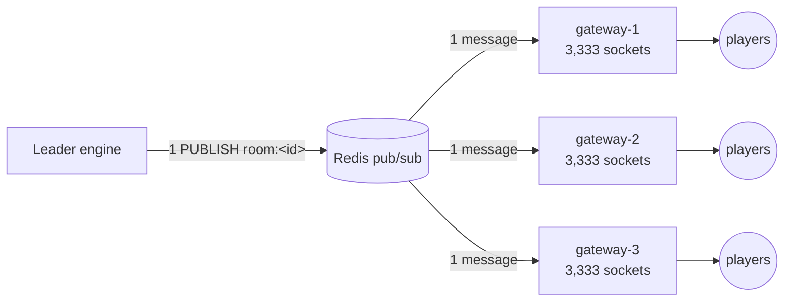
```mermaid
flowchart LR
    E["Leader engine"] -->|"1 PUBLISH room:&lt;id&gt;"| R[(Redis pub/sub)]
    R -->|1 message| G1["gateway-1<br/>3,333 sockets"]
    R -->|1 message| G2["gateway-2<br/>3,333 sockets"]
    R -->|1 message| G3["gateway-3<br/>3,333 sockets"]
    G1 --> P1((players))
    G2 --> P2((players))
    G3 --> P3((players))
```

- A gateway **subscribes to a room only while it has players in it**, and sends the same raw bytes to each local socket (no re-encoding per player).
- **Personal results** ("you got +864, rank 46") can't be broadcast. After a reveal, each gateway looks up its own players in Redis, **pipelined 500 at a time**: for 3,333 players that's 7 round trips instead of 16,000.
- Measured with 10,000 players: gateways finished sending a question to all their sockets in **118 ms at the median, 198 ms at p99** (from the engine publishing it); players, all simulated in one Node process on the same 2 cores, received it at 255 ms median ([12](#12-load-test-results)).

### 8.3 Fair timing: the server clock decides

> [!NOTE]
> **In simple words:** your phone's clock might be 3 minutes wrong. So your phone never decides whether you were in time. The gateway notes the moment your answer *arrived*, and that is compared with the deadline the leader set.

| Rule | Why |
|---|---|
| The leader sets `deadline = openedAt + 10 s` (server time) and sends both | Everyone gets the same absolute deadline |
| The browser syncs its clock: 5 pings, keeps the one with the smallest round trip, `offset = serverTime − (t0 + rtt/2)` | The countdown ring shows *server* time, so all players see the same number |
| The gateway stamps `receivedAt` the moment the message arrives, before anything else | Waiting behind a slow Redis call can't make a fast answer "late" |
| An answer counts if `receivedAt ≤ deadline + 300 ms` | A small grace for the network, the same for everyone |
| **First answer wins** (`HSETNX`) | Changing your answer after seeing others' is impossible; retries are harmless |
| Points = 500 + 500 × (time left ÷ 10 s) for a right answer | Faster is better, but any right answer beats a wrong one |
| The correct answer is **encrypted** until the deadline and **never sent before the reveal** | Nothing to find by inspecting the page or the WebSocket frames |

### 8.4 The answer burst: a Redis Stream

> [!NOTE]
> **In simple words:** the gateways drop every answer into a conveyor belt (a Redis Stream). The leader picks answers off the belt in handfuls of up to 1,000. If the leader dies, the belt keeps moving and holds everything until the next leader picks it up.

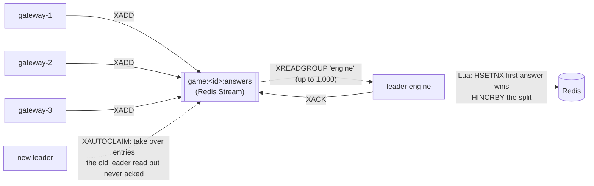
```mermaid
flowchart LR
    G1[gateway-1] -->|XADD| S[["game:&lt;id&gt;:answers<br/>(Redis Stream)"]]
    G2[gateway-2] -->|XADD| S
    G3[gateway-3] -->|XADD| S
    S -->|"XREADGROUP 'engine' (up to 1,000)"| E[leader engine]
    E -->|"Lua: HSETNX first answer wins<br/>HINCRBY the split"| R[(Redis)]
    E -->|XACK| S
    E2[new leader] -.->|"XAUTOCLAIM: take over entries<br/>the old leader read but never acked"| S
```

- The gateway acknowledges the player (`RECEIVED`) only **after** the stream write succeeded. So "acknowledged" means "stored".
- The consumer group remembers what has been read and what is **pending** (read but not acknowledged). A new leader first runs `XAUTOCLAIM` to take over the old leader's pending entries: an answer the old leader read right before crashing is not lost.
- At the deadline the leader **waits until the stream is drained** (no lag, nothing pending) before scoring, so an answer that arrived at 9.9 s is never missed.
- Why a stream and not direct writes from the gateways? The leader is the one place that validates answers against the *current* question and phase, and during a failover there is no leader: the stream holds answers until there is one (173 answers in the [failover demo](#87-failover-resuming-in-the-middle-of-a-question)).

### 8.5 Consensus and leader election with etcd

> [!NOTE]
> **In simple words:** three etcd servers vote on every change. A change only happens when at least two agree (a *majority*). Engines ask etcd "make me the leader of game 42, but only if nobody is". Because a majority must agree and only one request can come first, only one engine can ever win.

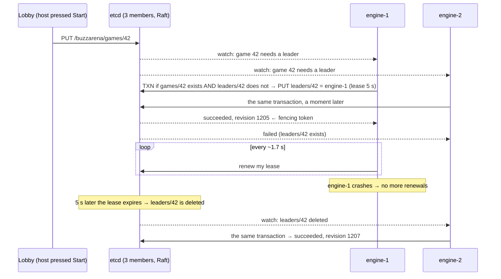
```mermaid
sequenceDiagram
    participant L as Lobby (host pressed Start)
    participant X as etcd (3 members, Raft)
    participant E1 as engine-1
    participant E2 as engine-2
    L->>X: PUT /buzzarena/games/42
    X-->>E1: watch: game 42 needs a leader
    X-->>E2: watch: game 42 needs a leader
    E1->>X: TXN if games/42 exists AND leaders/42 does not → PUT leaders/42 = engine-1 (lease 5 s)
    E2->>X: the same transaction, a moment later
    X-->>E1: succeeded, revision 1205  ← fencing token
    X-->>E2: failed (leaders/42 exists)
    loop every ~1.7 s
        E1->>X: renew my lease
    end
    Note over E1: engine-1 crashes → no more renewals
    Note over X: 5 s later the lease expires → leaders/42 is deleted
    X-->>E2: watch: leaders/42 deleted
    E2->>X: the same transaction → succeeded, revision 1207
```

- **Raft in one paragraph:** the three members elect one Raft leader among themselves; every write goes through it and is committed once 2 of 3 have it on disk. Lose one member: still a majority, everything works. Lose two: no majority, no writes, and no elections (see [8.13](#813-cap-again-when-etcd-loses-its-majority)).
- **Leases** turn "is engine-1 alive?" into something etcd can decide: a key attached to a lease disappears on its own when the lease isn't renewed.
- **Spreading games:** an engine that already leads games waits a little longer before campaigning (250 ms per game), so games spread across engines.
- **Self-fencing:** each engine watches its own renewals. If it hasn't renewed in (TTL − 1.2 s), it **stops acting as leader by itself**, before etcd even expires the key.

Code: [`services/src/engine/election.js`](services/src/engine/election.js).

### 8.6 Fencing tokens and the zombie leader

> [!NOTE]
> **In simple words:** every leader gets a ticket number, and numbers only go up. The storage keeps the highest number it has seen and refuses writes with a lower one. A leader that "died", got replaced and came back is holding an old number, so everything it tries to write bounces.

This is the problem that makes leader election hard. An engine freezes (a long garbage-collection pause, a VM stall, a laptop lid). Its lease expires, another engine takes over. Then the frozen one **wakes up**: its timers fire immediately, and it has no idea time passed.

<div align="center">

</div>

Every write from an engine goes through a Lua script that checks the token first ([`services/src/shared/redis.js`](services/src/shared/redis.js)):

```lua
-- fencedPublish: KEYS = fence, seq, state, log
local fence = tonumber(redis.call('GET', KEYS[1]) or '0')
local token = tonumber(ARGV[1])
if token < fence then return {-1, fence} end        -- an older leader: refuse
if token > fence then redis.call('SET', KEYS[1], token) end
local seq = redis.call('INCR', KEYS[2])             -- number the message
-- … append to the resume log, save the checkpoint, PUBLISH to the room: all or nothing
```

**Two lines of defence**, and the demo shows both:

| Layer | What stops the zombie | `npm run demo:zombie` result |
|---|---|---|
| 1. **Self-fencing** (default) | It checks its lease before every write: "not renewed in time → stop" | *engine-1 noticed its lease had not been renewed and stopped before writing anything* |
| 2. **The fencing token** (`SELF_FENCING=false`) | Redis sees token 1217 < fence 1219 and rejects the write | *engine-2 tried to write with token 1217; Redis already had the newer token 1219 and rejected the write* |

And a third one on the **database**: `games.leader_token` is raised by every new leader, and the final results are only saved by a leader whose token is at least that high. Players saw tokens `1217 → 1219` and never a message from the old leader after the new one took over.

### 8.7 Failover: resuming in the middle of a question

> [!NOTE]
> **In simple words:** after every step, the leader writes down exactly where the game is (like a save point in a video game). A new leader loads the save point and carries on. A question that was open stays open until its **original** deadline.

<div align="center">
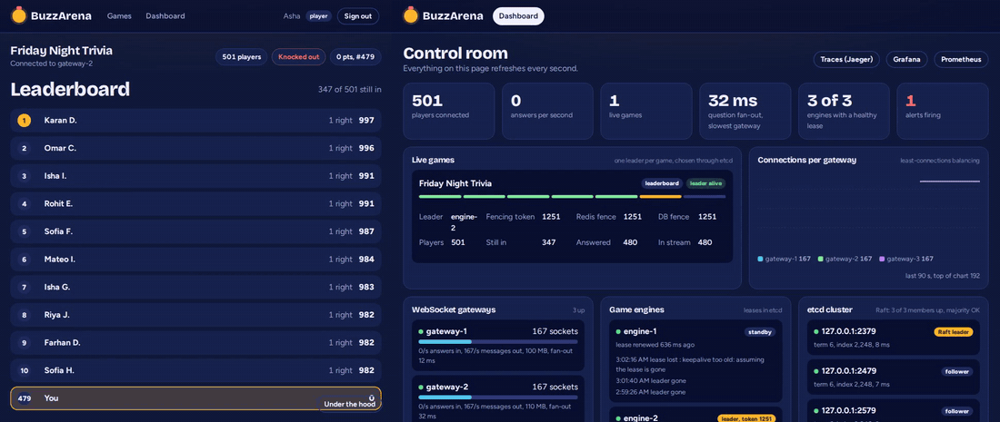
<br/><sub>Left, a player; right, the control room. The leader is killed during question 2. The dashboard shows "no leader heartbeat for 4.2 s", then a new leader (token 1253). The player's countdown never stopped, and the reveal came on time.</sub>
</div>

What the new leader does ([`services/src/engine/game.js`](services/src/engine/game.js)):

1. Raises the fence in Redis and in PostgreSQL to its token (if something newer is already there, it steps down).
2. Reads the checkpoint: `phase=QUESTION, q=1, openedAt, deadline, seq`.
3. Announces itself (`leader` message, with how long there was silence).
4. Claims answers the old leader read but never acknowledged (`XAUTOCLAIM`).
5. Continues: in `QUESTION`, it sets its timer to the **original** deadline; in `LOCKED` it re-scores (safe: scoring uses `HSETNX` per player, so nobody is scored twice); in `REVEAL`/`LEADERBOARD` it waits out the remaining time.

<div align="center">

</div>

`npm run demo:failover`, with 500 players:

| | Result |
|---|---|
| Leader killed | with 6.0 s left on question 2 |
| New leader | after **4.8 s** of silence, token 1205 → 1207 |
| Question 2 | sent **once**, kept its original deadline; revealed 0.37 s after it |
| Answers sent while there was **no leader** | **173, all counted** |
| Missed messages | **0** for all 500 players |

### 8.8 Reconnect and resume

> [!NOTE]
> **In simple words:** every room message has a number. Your app remembers the last number it saw. After reconnecting (to any gateway) it says "I have up to #11", and the gateway sends #12, #13… from a log in Redis.

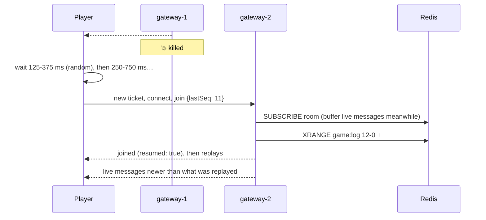
```mermaid
sequenceDiagram
    participant P as Player
    participant G1 as gateway-1
    participant G2 as gateway-2
    participant R as Redis
    G1-->>P: #11 question
    Note over G1: 💥 killed
    P->>P: wait 125-375 ms (random), then 250-750 ms…
    P->>G2: new ticket, connect, join {lastSeq: 11}
    G2->>R: SUBSCRIBE room (buffer live messages meanwhile)
    G2->>R: XRANGE game:log 12-0 +
    G2-->>P: joined (resumed: true), then replays #12, #13…
    G2-->>P: live messages newer than what was replayed
```

- **Backoff with jitter:** 1,000 players who lose the same gateway must not come back in the same millisecond. Each waits a random time that doubles on every failed try.
- **No gap, no duplicate:** while a gateway replays the log, it buffers live messages for that player, then sends only those with a higher number. The client also ignores numbers it has seen.
- **Answers during a reconnect** are queued in the app and sent right after the join (they still have to arrive before the deadline).
- If the log no longer reaches back far enough (500 messages), the player gets the current state from the start of the current question instead.

<div align="center">

</div>

`npm run demo:gateway`: 1,500 players, the busiest gateway is killed during question 2. **500 of 500 reconnected and resumed**, split 250 / 250 across the other gateways, **0 missed messages**, and the 63 answers already sent to the dead gateway counted (they were in the stream). Getting back in took 2.3 s at the median here: all 500 simulated phones reconnect from *one* Node process whose TLS handshakes queue on the shared CPU; a single player reconnects in about 0.2 s.

### 8.9 Authentication

> [!NOTE]
> **In simple words:** your password is never stored, only a slow-to-compute fingerprint of it. After signing in you get a short-lived pass (15 minutes) that any server can check on its own, and a long-lived "renewal slip" that changes every time you use it, so a copied slip is spotted the moment either copy is used.

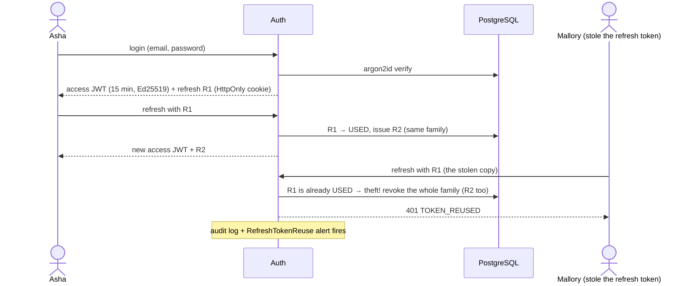
```mermaid
sequenceDiagram
    actor U as Asha
    participant A as Auth
    participant DB as PostgreSQL
    actor M as Mallory (stole the refresh token)
    U->>A: login (email, password)
    A->>DB: argon2id verify
    A-->>U: access JWT (15 min, Ed25519) + refresh R1 (HttpOnly cookie)
    U->>A: refresh with R1
    A->>DB: R1 → USED, issue R2 (same family)
    A-->>U: new access JWT + R2
    M->>A: refresh with R1 (the stolen copy)
    A->>DB: R1 is already USED → theft! revoke the whole family (R2 too)
    A-->>M: 401 TOKEN_REUSED
    Note over A: audit log + RefreshTokenReuse alert fires
```

| Piece | Choice | Why |
|---|---|---|
| Passwords | **argon2id** (19 MiB, 2 passes: OWASP's minimum) | Deliberately slow and memory-hungry, so stolen hashes are expensive to crack |
| Unknown email | Still runs argon2id against a dummy hash | A wrong password takes the same ~25 ms whether the account exists or not |
| Access tokens | **JWT, Ed25519 (EdDSA)**, 15 minutes, `iss`/`aud` checked | Signed with a private key only the auth service has; everyone verifies with the public keys |
| Key distribution | **JWKS** at `/api/auth/.well-known/jwks.json`, cached by every service | If the auth service is down, running games and the lobby keep verifying tokens |
| Key rotation | New active key; old public keys stay published for a day | Tokens signed before the rotation keep working until they expire ([test 13](#12-load-test-results)) |
| Refresh tokens | Random, stored as **SHA-256** only, **rotated on every use**, grouped in a family | A reused token = a stolen token → the whole family is revoked |
| Refresh cookie | `HttpOnly; Secure; SameSite=Strict; Path=/api/auth` | JavaScript can't read it; other sites can't send it |
| WebSockets | One-time 30-second tickets ([8.1](#81-websockets-at-scale)) | Access tokens never appear in URLs |
| Guessing | Token bucket per email + per IP at the API, and per IP at Nginx | Password guessing stops after 10 tries |

<div align="center">

</div>

### 8.10 Authorization: roles and ownership

> [!NOTE]
> **In simple words:** *authentication* is "who are you?". *Authorization* is "what may you do?". A host may start games, but only **their own**.

| Rule | Checked by | Refused with |
|---|---|---|
| Only hosts and admins create games | Role in the token (`requireRole('host','admin')`) | `403 ROLE_REQUIRED` |
| A host may only start, cancel or watch **their own** game | Ownership: `game.host_id === user.id` (admins may do all) | `403 NOT_YOUR_GAME` |
| Only admins see the question bank with answers, users, the audit log, rotate keys | Role | `403 ROLE_REQUIRED` |
| Only players who joined **before** the start can answer | Gateway (and again the engine) | `SPECTATOR` |
| Changing a role signs that user out everywhere | Refresh tokens revoked | the new role applies at the next sign-in |

Roles live inside the signed token, so no database lookup is needed per request; the cost is that a role change takes effect when the user's access token is replaced, which is why a role change also revokes their refresh tokens.

### 8.11 Encryption: in transit and at rest

| Where | How |
|---|---|
| **Browser ↔ Nginx** | TLS 1.2/1.3 for HTTPS **and** WSS. HTTP redirects to HTTPS. HSTS, a strict Content-Security-Policy (`default-src 'self'`, WebSocket only to this host), `X-Frame-Options: DENY`, `nosniff`. |
| **Correct answers** | AES-256-GCM, stored as `k1:iv:tag:ciphertext`. The question id is used as additional authenticated data, so a ciphertext copied to another question fails to decrypt. |
| **JWT private keys** | Also AES-256-GCM in the database, decrypted only in the auth service's memory. |
| **Refresh tokens** | Not encrypted: **hashed** (SHA-256). A database leak reveals nothing usable. |
| **Key rotation** | Add a new data key, make it active, run `npm run rotate:data-key` to re-encrypt old rows; then remove the old key. Every ciphertext says which key made it, so both work during the switch. |

The dev certificate in `nginx/certs/` is self-signed for `localhost` (your browser warns once). Use [mkcert](https://github.com/FiloSottile/mkcert) for a trusted local certificate, or real certificates in production.

### 8.12 Observability: metrics, logs, traces, alerts

> [!NOTE]
> **In simple words:** *metrics* are the car's dashboard (speed, temperature), *logs* are the black box (what happened, in words), and *traces* are a GPS track of one journey through many services. You need all three to answer "why didn't my answer count?".

<div align="center">

</div>

| Signal | How | Example |
|---|---|---|
| **Metrics** | `prom-client` on every service at `/metrics`, scraped by Prometheus every 5 s | `buzz_ws_fanout_seconds`, `buzz_engine_fenced_writes_total{store}`, `buzz_engine_answer_stream_lag`, `buzz_auth_refresh_reuse_detected_total` |
| **Logs** | JSON (pino), shipped to Loki; every line has `service`, `instance` and the `trace_id` of the current span | `{"service":"engine","instance":"engine-1","trace_id":"40dd…","msg":"answer accepted"}` |
| **Traces** | OpenTelemetry → Jaeger. The gateway starts a span per answer and puts the **W3C `traceparent` into the stream entry**; the engine continues the same trace | `ws.answer → redis XADD → engine.record_answer → redis EVAL / XACK` |
| **Alerts** | 10 Prometheus rules → Alertmanager | `LiveGameWithoutLeader`, `EtcdNoLeader`, `StaleLeaderFenced`, `RefreshTokenReuse`, `SlowQuestionFanout`… |

The acknowledgement a player gets carries the trace id, and the "Under the hood" panel links straight to it. One answer in Jaeger:

<div align="center">
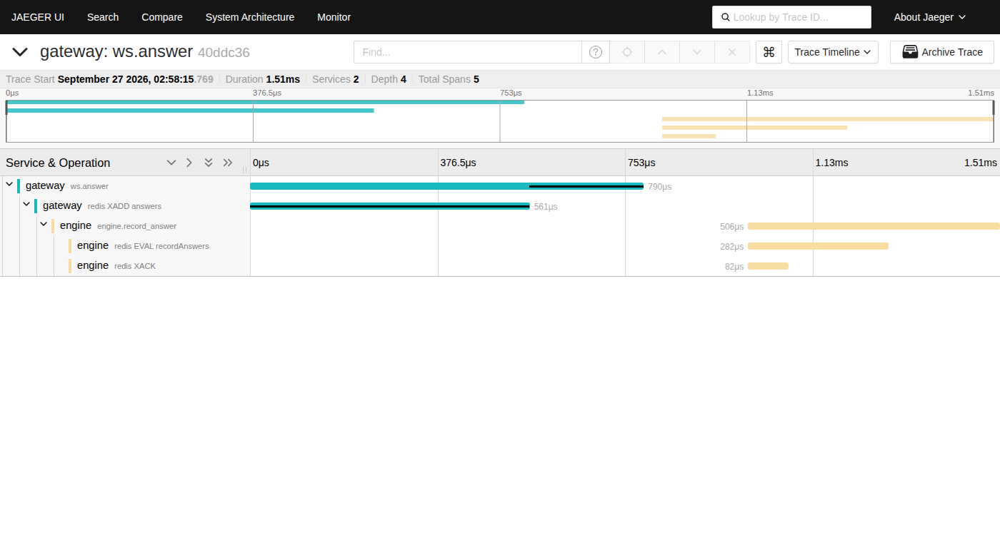
</div>

Alerts firing while etcd had no majority (from [8.13](#813-cap-again-when-etcd-loses-its-majority)):

<div align="center">
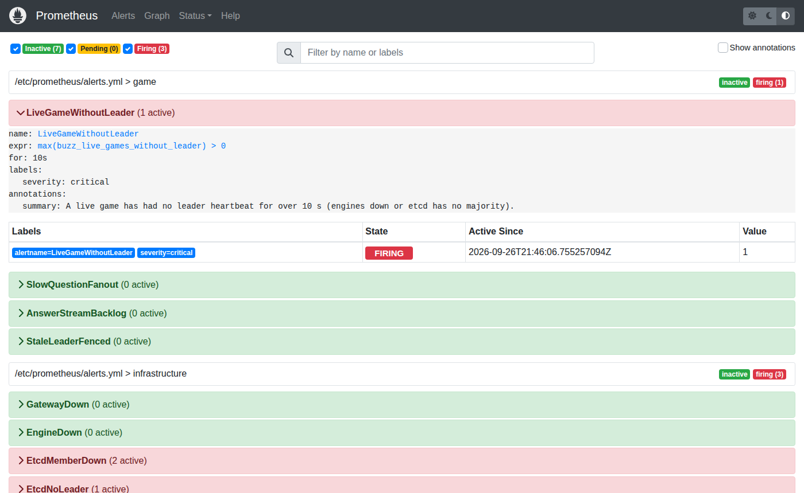
</div>

Grafana is provisioned with Prometheus, Loki and Jaeger as data sources and a **BuzzArena overview** dashboard ([`observability/grafana/`](observability/grafana)); clicking a `trace_id` in a log line opens the trace, and a trace links back to its logs. Trace sampling is set by `TRACE_SAMPLE_RATIO` (1 = every answer, 0.02 in load tests).

### 8.13 CAP again: when etcd loses its majority

> [!NOTE]
> **In simple words:** with only one of three etcd members left, nobody can prove who the leader is. The system could keep the game going and hope, or **pause** and be sure. It pauses: a paused quiz is annoying; two leaders sending different questions is broken.

<div align="center">

</div>

`npm run demo:consensus`, with 200 players:

| Step | What happened |
|---|---|
| Stop 1 etcd member (2 of 3 left) | Majority intact. The game leader is killed: a new one is elected after **5.2 s**, as usual. |
| Stop a 2nd member (1 of 3 left) | No majority. The leader can't renew its lease and **stops itself** within ~4 s. All 3 engines report an unhealthy lease; the game is frozen at question 4; starting another game returns `503 COORDINATION_UNAVAILABLE`; the alerts fire. |
| Bring one member back | Majority again. A leader is elected **8.0 s** later (etcd restarts the lease countdown when it has a leader again) and the game resumes from its checkpoint. |
| Result | **0 missed messages** for all 200 players. Leaders: engine-3 (1227) → engine-1 (1229) → engine-2 (1231). |

| Data | Choice during a partition | Like Project 2's |
|---|---|---|
| Who leads a game (etcd) | **CP**: no majority, no leader | votes (`w: majority`) |
| Live answers from players | Accepted by gateways until the deadline, kept in the stream | accepting and queueing |
| The lobby, history, leaderboards | Keep working (PostgreSQL, Redis) | live results (AP) |

## 9. Live Dashboard

Open **https://localhost:8443/#/dashboard** (no login needed). It refreshes every second:

- 🔌 **Players connected**, answers per second, live games, question fan-out time, engines with a healthy lease, alerts firing
- 👑 **Live games**: phase, question, the **leader from etcd**, its fencing token, the **fence in Redis and in PostgreSQL**, the leader's heartbeat age, answers waiting in the stream
- 📈 **Connections per gateway** over time (watch a crashed gateway's players move)
- 🧠 **Game engines**: lease health, which games each leads and with which token, recent events (elected, stepped down, fenced, lease lost)
- 🗳️ **etcd**: which member is the Raft leader, term, index, and a clear **NO MAJORITY** warning
- 🔔 **Alerts** from Prometheus, **authentication** (sign-ins, tickets, stolen tokens caught), **data** (replica lag, sessions)

<div align="center">
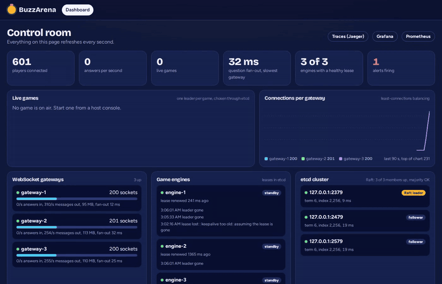
<br/><sub>3,000 bot players, 6 questions (4× speed). In question 3 the leader is killed: "no leader heartbeat", then a new leader and token. In question 5 a gateway is killed: its 1,000 players move to the other two.</sub>
</div>

| During a game | etcd with no majority |
|---|---|
| 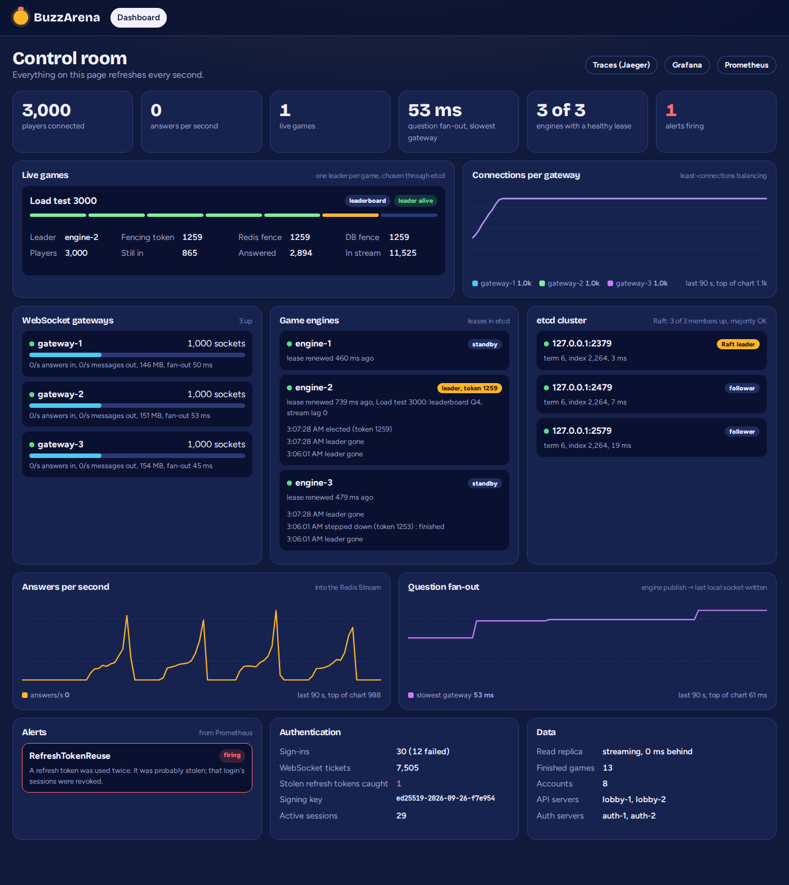 | 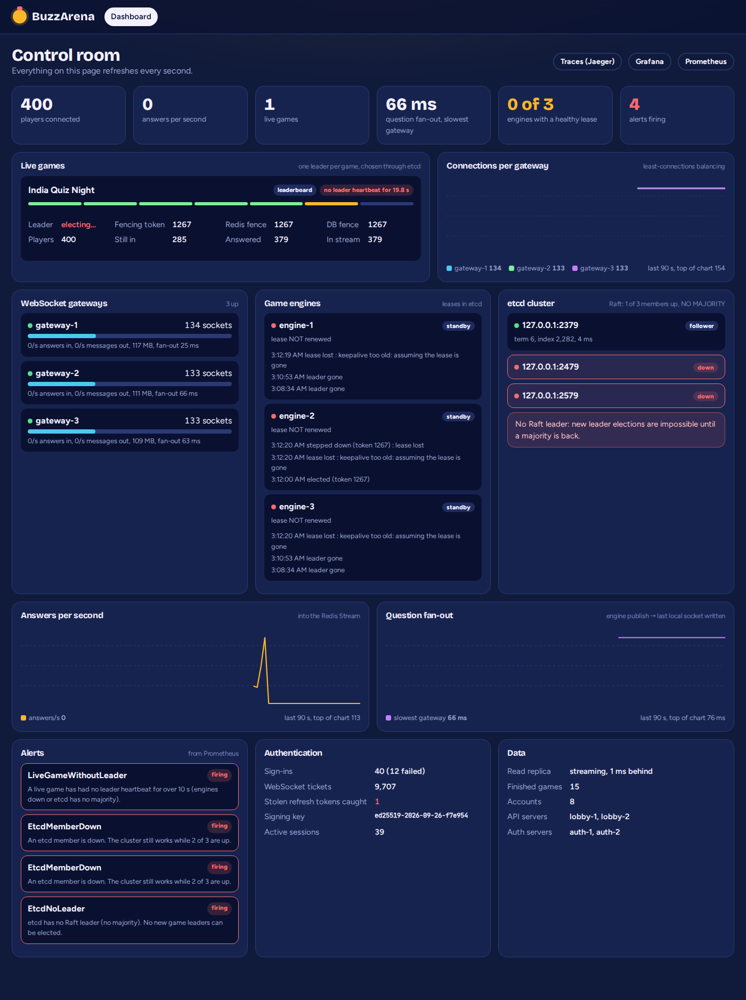 |

## 10. Failure Scenarios

| What goes wrong | What happens | Why it works |
|---|---|---|
| **The game leader crashes mid-question** | New leader in ~5 s; the question keeps its deadline; answers sent meanwhile are counted | Lease expiry + checkpoint + stream ✅ *tested (173 of 173 counted)* |
| **The leader freezes and wakes up (zombie)** | It stops by itself, or its writes are rejected | Self-fencing + fencing tokens in Redis and PostgreSQL ✅ *tested, both layers* |
| **A leader crashes after reading answers, before acknowledging them** | The new leader claims them | Consumer group pending list + `XAUTOCLAIM` ✅ *by design* |
| **A leader crashes while scoring** | The new leader scores again; nobody is scored twice | `HSETNX` per player per question ✅ *by design* |
| **A gateway crashes** | Its players reconnect elsewhere and resume; 0 missed messages | Sequence numbers + replay log + backoff with jitter ✅ *tested (500 and 1,667 players)* |
| **A crashed gateway comes back** | It gets its share of new players again | `max_fails=0` for the WebSocket upstream ✅ *found and fixed in the load test* |
| **1 of 3 etcd members down** | Nothing visible | Raft majority (2 of 3) ✅ *tested* |
| **2 of 3 etcd members down** | Games pause, no new games start (`503`); resume automatically | CP: leases can't be renewed ✅ *tested* |
| **The auth service is down** | Running games and the lobby keep working; new sign-ins fail | Cached JWKS; gateways only need tickets already issued ⚠️ *by design* |
| **A phone's clock is wrong** | Nothing: deadlines are server time | Gateway time stamps + clock sync ✅ *by design* |
| **A player's network is slow** | Their live counts are dropped; very slow sockets are closed and reconnect | Backpressure thresholds ✅ *by design* |
| **Duplicate or changed answers, answer spam** | First answer wins; spam is rate-limited | `HSETNX` + token bucket ✅ *tested* |
| **A stolen refresh token is used** | Both copies stop working; audit entry; alert | Rotation + reuse detection ✅ *tested* |
| **The read replica is down** | History and leaderboards read from the primary | Circuit breaker in `readQuery` (Project 2) |
| **Redis goes down** | ⚠️ Live games stop (Redis holds live state) until it's back; nothing acknowledged is lost with AOF | **Single point of failure here** (see Limitations) |
| **PostgreSQL goes down** | New sign-ins, new games and saving results fail; running questions continue | ⚠️ Results are saved again by the next leader step once it's back |

## 11. Trade-offs & Alternatives Considered

| Decision | Chosen | Alternative | Why |
|---|---|---|---|
| Real-time transport | WebSockets | Server-Sent Events (Project 2), long polling | Answers flow up and questions flow down on the same connection; SSE is one-way |
| Who runs a game | One leader engine per game | Every gateway runs the game logic; a database transaction per answer | One timer and one scorer per game is simple and fair; the price is leader election |
| Leader election | etcd leases (Raft) | Redis `SET NX` lock (Redlock), ZooKeeper, Consul sessions | A single Redis is not consensus and loses locks on failover; etcd is the standard small consensus store (Kubernetes uses it) |
| Stopping a stale leader | Fencing tokens checked by storage **and** self-fencing | Trust the lease | A lease only tells *others* you're gone; a frozen process doesn't know. Only the storage can reject it. |
| Failover granularity | Checkpoint after every step | Restart the question; restart the game | Players never see a question reopen or its deadline move |
| Answer path | Redis Stream + consumer group | Kafka (Project 3), direct writes by gateways | Same log semantics with the Redis already here; Kafka pays off at much larger scale or with many consumers |
| Fan-out | Redis pub/sub → gateways | Kafka topic per game, a message broker cluster, every gateway polling | Pub/sub is fire-and-forget, so missed messages are covered by the resume log |
| Timekeeping | Server receive time + 300 ms grace | Client timestamps; per-player latency compensation | Clients can lie; compensation is fairer for far-away players but can be gamed |
| Access tokens | Stateless Ed25519 JWT, 15 min | Server sessions; opaque tokens checked on every call | No auth call per request or per socket; short life limits the damage of a stolen token |
| WebSocket auth | One-time ticket | Token in the URL; cookie | URLs end up in logs; cookies on sockets invite cross-site hijacking |
| Balancing sockets | Nginx `least_conn`, no passive health marking | HAProxy/Envoy with active health checks | Nginx is already here; active checks would detect a dead gateway before any player tries it |
| Monolith or services | 4 services from one image | One process | Gateways and engines scale and fail independently; that's the lesson of this project |

## 12. Load Test Results

> [!NOTE]
> **Reference run:** a small cloud VM with **2 CPU cores and 8 GB RAM**. *Everything* ran on it at once: Nginx, 2 auth, 2 lobby, 3 gateway and 3 engine processes, a 3-member etcd cluster, Redis, PostgreSQL + replica, Prometheus, Alertmanager, Loki, Jaeger, **and the load generator: one Node process holding every simulated player's WebSocket and TLS connection**. The services ran as plain processes with the same code and the same Nginx template as the containers (Grafana was not part of this run). The players are real WebSocket clients going through Nginx and TLS. On 2 shared cores the load generator itself is the first thing to fall behind, so treat latencies as a floor; the **correctness** numbers are what matter. [Run the tests yourself](#-run-the-load-tests).
>
> *"p95"* means 95% were faster than this number.

<div align="center">
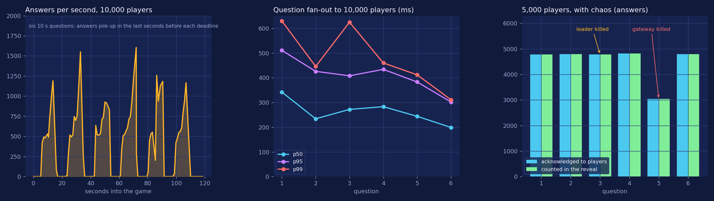
</div>

### Test 1: Game night, 5,000 players (`PLAYERS=5000 npm run load`)

6 questions of 10 s. Bots answer 96% of the time, mostly in the last few seconds, 70% of them correctly.

| | Result |
|---|---|
| Players connected (through Nginx + TLS) | **5,000** in 15.7 s, 0 failed, 1,667 per gateway |
| Question fan-out, as received by players (p50 / p95 / p99) | **134 / 235 / 264 ms** |
| Question fan-out, gateway side (engine publish → last local socket written) | p50 50 ms, p99 99 ms |
| Answer acknowledgement (p50 / p95 / p99) | **4 / 157 / 259 ms** |
| Answers acknowledged / counted | **28,771 / 28,771** |
| Peak answers per second · messages out per second | 1,609 · 20,171 |
| Highest answer stream lag | 67 |
| Missed or out-of-order messages | **0** |
| Final results saved for | **5,000 players** |
| Gateway memory | ~195 MB each |

### Test 2: Game night, 10,000 players (`PLAYERS=10000 npm run load`)

| | Result |
|---|---|
| Players connected | **10,000** in 31.8 s, 0 failed |
| Question fan-out, as received by players (p50 / p95 / p99) | **255 / 435 / 560 ms** |
| Question fan-out, gateway side (p50 / p95 / p99) | 118 / 192 / 198 ms |
| Answers acknowledged / counted | **52,229 / 52,229** |
| Peak messages out per second | 32,746 |
| Missed messages · results saved for | **0** · **10,000 players** |
| Gateway memory | ~286 MB each (~55 KB per socket) |

About 4,300 answers came back `TOO_LATE`: with 10,000 sockets, the single load-generator process fell behind and fired some bots' answers after the deadline (answer acknowledgement p95 970 ms). The system judged them by the time they arrived, which is exactly the rule.

### Test 3: 5,000 players with chaos (`KILL_LEADER_AT_Q=3 KILL_GATEWAY_AT_Q=5`)

| | Result |
|---|---|
| Leader killed in question 3 | new leader, highest stream lag **994** answers waiting, then drained |
| Gateway killed in question 5 | **1,667** players reconnected and resumed |
| Answers acknowledged / counted | **27,023 / 27,023**: **0 lost** |
| Missed messages | **0** |
| Final results saved for | **5,000 players** |
| Reconnect time for the 1,667 | 8.4 s (p50): 1,667 simultaneous TLS reconnections from one Node process, with Nginx on the same 2 cores |
| `TOO_LATE` answers | 1,764, mostly queued by players while reconnecting in question 5 and sent after its deadline |

➡️ Across all three runs: **every acknowledged answer was counted, and no player missed a message**, including through a leader crash and a gateway crash.

### Other checks

| Check | Result |
|---|---|
| `npm test` (end-to-end, through Nginx) | **13 / 13 passing**, with the normal (strict) rate limits |
| `npm run demo:failover` | 4.8 s to a new leader; question kept its deadline; 173 of 173 leaderless answers counted |
| `npm run demo:zombie` | both lines of defence observed (self-fencing; token rejected by Redis) |
| `npm run demo:gateway` | 500 of 500 resumed, 0 missed, 63 in-flight answers counted |
| `npm run demo:consensus` | 1 of 3 down: elections work; 2 of 3 down: paused, `503`, alerts; resumed 8.0 s after the majority returned |
| `npm run demo:security` | 26 attacks and checks, all refused as expected |
| `npm run demo:trace` | 5 spans across gateway and engine in one trace; 2 log lines found by trace id |
| k6 (`load-tests/k6/01-game-night.js`, 300 players) | 0 missed messages, fan-out p95 20 ms, all checks passing |
| Data key rotation k1 → k2 → k1 | 84 questions and the signing key re-encrypted and still readable |

## 13. Limitations & What I'd Do Differently

- ⚡ **Redis is a single point of failure.** It holds all live game state. Production would use Redis with replicas and Sentinel (or a managed Redis), and treat a Redis failover like an engine failover: the checkpoint and stream would need to be on the replicas first (`WAIT`).
- 🐘 **No automatic PostgreSQL failover** (the replica only serves reads). Patroni or a managed database would promote it.
- 🧮 **One Redis channel and one leader per game.** A single game much larger than ~100,000 players would need the fan-out split (several channels per game, or a dedicated push service) and the answer stream sharded.
- 🌍 **One region.** Players far away get questions later and have less real time to answer. Edge gateways in several regions, and per-region latency compensation, would make it fairer.
- 🩺 **Nginx has no active health checks** for the gateways. HAProxy or Envoy would stop sending players to a dead gateway before any of them tries it.
- 🔒 **Service-to-service traffic is not encrypted** inside the Docker network, and Redis/etcd use passwords or nothing. Production: mTLS between services, etcd client certificates, Redis ACLs.
- 🔑 **Secrets live in environment variables.** A secrets manager (Vault, a cloud KMS) would hold the data keys and could do envelope encryption.
- 🤖 **No bot detection.** Real quiz shows need device checks, a CAPTCHA at sign-up and anomaly detection on answer timing.
- 🧪 **The load generator shares the CPU with the system.** Running it on separate machines would show the system's real limits instead of the generator's.

## 14. Tech Stack

| Layer | Technology | Why |
|---|---|---|
| Services | **Node.js 22**, Express 5, `ws` (one image, `SERVICE` picks the service) | Event loop fits many idle connections; `ws` is fast and minimal |
| Consensus | **etcd 3.5** ×3 (Raft), `etcd3` client | Leases, transactions and watches: everything leader election needs |
| Live state | **Redis 7**: pub/sub, Streams + consumer groups, sorted sets, Lua | Fan-out, the answer burst, leaderboards and fenced atomic writes |
| Durable data | **PostgreSQL 16** + streaming read replica | Accounts, questions, results; replica for reads (Project 2) |
| Edge | **Nginx** (1.27 in Docker) | TLS, WebSocket upgrade, least-connections balancing, rate limits, security headers |
| Auth | `@node-rs/argon2`, `jose` (Ed25519 JWT, JWKS) | Modern password hashing and signatures |
| Encryption | Node `crypto`: AES-256-GCM | Authenticated encryption with key ids for rotation |
| Metrics / alerts | **Prometheus**, **Alertmanager**, `prom-client` | The standard for metrics and alert rules |
| Logs | **pino** → **Loki** | Structured JSON logs, searchable by trace id |
| Traces | **OpenTelemetry** SDK → collector → **Jaeger** | Vendor-neutral tracing; W3C `traceparent` across the stream |
| Dashboards | **Grafana** (provisioned) + the built-in control room | Metrics ↔ logs ↔ traces in one place |
| Frontend | **React 19 + Vite**, self-hosted fonts | Player, host, admin and dashboard pages; strict CSP-friendly build |
| Infrastructure | **Docker Compose** | 24 services with one command |
| Testing | Node test runner, a Node load generator, **k6** | End-to-end tests, game-night load tests with chaos |

## 15. Project Structure

```
buzzarena/
├── services/                       # every backend service (one Docker image)
│   └── src/
│       ├── main.js                 # SERVICE=auth|lobby|gateway|engine|seed|rotate-data-key
│       ├── shared/
│       │   ├── redis.js            # Lua scripts: fencedPublish, fencedScore, recordAnswers, token bucket
│       │   ├── auth.js             # JWT verification with cached JWKS, RBAC middleware
│       │   ├── crypto.js           # AES-256-GCM with key ids
│       │   ├── tracing.js          # OpenTelemetry spans, traceparent in and out
│       │   ├── logger.js · metrics.js · db.js · http.js · ops.js · config.js · errors.js
│       ├── auth/                   # sign-up, login, refresh rotation, WS tickets, keys (JWKS, rotation)
│       ├── lobby/                  # games, packs, host console, history, admin, dashboard data
│       ├── gateway/                # WebSockets: tickets, fan-out, resume, answers, backpressure
│       ├── engine/
│       │   ├── election.js         # etcd leases, campaigns, self-fencing
│       │   ├── game.js             # the game state machine, scoring, failover resume
│       │   └── index.js            # watches etcd, campaigns, runs the games it leads
│       ├── seed/                   # 7 question packs (84 questions), demo accounts, past games
│       └── tools/rotate-data-key.js
├── web/                            # React: sign-in, lobby, game, host, admin, control room
├── nginx/                          # TLS + WebSocket config template, dev certificate, Dockerfile
├── db/                             # schema, replication setup
├── observability/                  # prometheus + alerts, alertmanager, loki, otel-collector, grafana
├── scripts/                        # demos (game, failover, zombie, gateway, consensus, security, trace), bots
├── tests/e2e.test.mjs              # 13 end-to-end tests
├── load-tests/                     # game-night.mjs (with chaos), k6/, results/
├── docs/                           # architecture, screenshots, demo GIFs and video
├── docker-compose.yml              # 24 services (+ k6)
├── .env.example                    # every setting
└── .env.loadtest                   # relaxes per-IP limits and enables bot accounts
```

## 16. How to Run

### What you need

- **Docker Desktop** (Windows / macOS) or Docker Engine + Compose v2 (Linux), with **at least 4 GB of memory** for Docker
- **Node.js 20+**, only for the tests, demos, bots and the load test
- Free ports: `8080` / `8443` (app), `3000` (Grafana), `9090` (Prometheus), `9093` (Alertmanager), `16686` (Jaeger), `3100` (Loki), `5438`/`5439` (PostgreSQL), `6383` (Redis), `2379`/`2479`/`2579` (etcd)

### 1. Start everything

```bash
git clone <your-repo-url> buzzarena
cd buzzarena
docker compose up --build -d
```

The first start takes a few minutes (images download, the web app builds, the seed creates the question bank and demo accounts). Check it:

```bash
docker compose ps              # services "healthy", seed "exited (0)"
docker compose logs seed       # "seed complete"
```

### 2. Open the app

| Page | URL |
|---|---|
| 🎮 App | **https://localhost:8443** (accept the self-signed certificate once) |
| 📊 Control room | **https://localhost:8443/#/dashboard** |
| 📈 Grafana | http://localhost:3000 (dashboard "BuzzArena overview") |
| 🔍 Jaeger | http://localhost:16686 |
| 🔔 Prometheus alerts | http://localhost:9090/alerts |

**Demo accounts** (also one click away on the sign-in page; change them for anything beyond a laptop):

| Who | Email | Password |
|---|---|---|
| Anita, admin | `admin@buzzarena.dev` | `arena-admin-2026` |
| Meera, host | `meera@buzzarena.dev` | `host-meera-2026` |
| Rohan, host | `rohan@buzzarena.dev` | `host-rohan-2026` |
| Asha, Kabir, Priya, Vikram, Zoya: players | `asha@buzzarena.dev`… | `play-asha-2026`, `play-kabir-2026`… |

**Things to try:**

1. 🎮 Sign in as **Meera** in one window and **Asha** in a private window. Asha opens *Friday Night Trivia*; Meera opens it from **Host** and presses **Start**.
2. 🤖 Want a crowd? Restart with the load-test settings (below) and run `npm run bots -- 300` before pressing Start.
3. 👀 Open **Under the hood** (bottom right) during the game: your gateway, clock offset, sequence numbers, the leader and its token, and trace links for your answers.
4. 👑 In the host console, note the leader (e.g. `engine-2`) and run `docker compose kill engine2` during a question. Watch the dashboard and the player's screen.
5. 🔌 `docker compose kill gateway1`: players on it reconnect and carry on. `docker compose start gateway1` afterwards.
6. 🗳️ `docker compose stop etcd2 etcd3`: the game pauses and alerts fire. `docker compose start etcd2 etcd3`: it resumes.

### 3. Run the tests

```bash
npm install                 # ws + jose, for the tests and scripts
npm test                    # 13 end-to-end tests against https://localhost:8443 (about 75 s)
```

### 🧪 Run the demos

Most demos use bot players, which need bot accounts enabled and relaxed per-IP limits (all bots come from your computer):

```bash
docker compose --env-file .env.loadtest up -d
```

| Command | Teaches | Takes |
|---|---|---|
| `npm run demo:game` | A whole game narrated in the terminal (300 bots) | ~70 s |
| `npm run demo:failover` | Kill the leader mid-question; nothing lost | ~90 s |
| `npm run demo:zombie` | A frozen leader wakes up and is fenced | ~85 s |
| `npm run demo:gateway` | Kill a gateway; 1,500 players resume | ~90 s |
| `npm run demo:consensus` | etcd with 2 of 3, then 1 of 3 members | ~2.5 min |
| `npm run demo:security` | Forged tokens, stolen refresh tokens, tickets, cheating | ~20 s |
| `npm run demo:trace` | One answer through Jaeger and Loki | ~20 s |

To see the **second** line of defence in the zombie demo, turn self-fencing off first:

```bash
SELF_FENCING=false docker compose --env-file .env.loadtest up -d engine1 engine2 engine3
npm run demo:zombie
docker compose --env-file .env.loadtest up -d engine1 engine2 engine3     # back to normal
```

The demos stop and start containers with `docker compose kill/stop/start/pause/unpause`. To use something else, set `CTL`, e.g. `CTL="./my-ctl.sh {action} {name}"`.

### 🔥 Run the load tests

```bash
docker compose --env-file .env.loadtest up -d

PLAYERS=2000 npm run load                                        # a game night
PLAYERS=5000 KILL_LEADER_AT_Q=3 KILL_GATEWAY_AT_Q=5 npm run load  # with chaos
PLAYERS=5000 QUESTIONS=8 QUESTION_SEC=15 npm run load

# or with k6, inside Docker (nothing to install):
docker compose --env-file .env.loadtest --profile loadtest run --rm -e PLAYERS=1000 k6 run /scripts/01-game-night.js
```

Results are printed and saved in `load-tests/results/`. Keep the control room open while they run. Go back to normal settings with `docker compose up -d`.

### Useful commands

```bash
# Logs (JSON)
docker compose logs -f engine1 engine2 engine3          # elections, takeovers, FENCED
docker compose logs -f gateway1 gateway2 gateway3

# etcd: who leads which game?
docker compose exec etcd1 etcdctl get --prefix /buzzarena/leaders/ -w json
docker compose exec etcd1 etcdctl endpoint status --cluster -w table

# Redis: a game's checkpoint and fence
docker compose exec redis redis-cli -a buzzarena --no-auth-warning keys 'game:*:state'
docker compose exec redis redis-cli -a buzzarena --no-auth-warning hgetall game:<id>:state

# PostgreSQL: the encrypted answers
docker compose exec postgres psql -U buzzarena -c "select text, left(correct_enc, 30) from questions limit 3"

# Rotate the data key: add k2 to DATA_KEYS, set DATA_KEY_ACTIVE=k2, restart, then:
npm run rotate:data-key

# Break things (and watch the dashboard)
docker compose kill engine2          # leader crash → failover
docker compose pause engine2         # a zombie in the making; unpause later
docker compose kill gateway1         # players move and resume
docker compose stop etcd2 etcd3      # no majority → the game pauses
```

Working on the frontend with live reload (the backend keeps running in Docker):

```bash
cd web && npm install && npm run dev       # http://localhost:5173, API and WebSocket go to :8443
```

### Start again with fresh data

```bash
docker compose down -v      # -v deletes the database, Redis and etcd volumes
docker compose up -d
```

### Settings

Every setting is in [`.env.example`](.env.example). Copy it to `.env` and change it. Some fun ones:

- `LEADER_LEASE_TTL_SEC=2`: faster failover (and more false alarms on a busy laptop)
- `SELF_FENCING=false`: let the fencing token catch zombies instead
- `QUESTION_SEC=20` · `ANSWER_GRACE_MS=0`: longer questions, no grace
- `TRACE_SAMPLE_RATIO=0.1`: trace 10% of answers
- `ACCESS_TOKEN_TTL_SEC=60`: watch the app refresh its token every minute (Under the hood → API requests)

### Troubleshooting

| Problem | Fix |
|---|---|
| The browser warns about the certificate | It's the self-signed dev certificate. Accept it once, or create a trusted one with `mkcert localhost` and put it in `nginx/certs/` |
| `seed` exited with an error | The database wasn't ready yet: `docker compose up -d seed` again (it only adds what is missing) |
| Nothing happens when the host presses Start | Check `docker compose logs engine1`: engines need etcd. `docker compose exec etcd1 etcdctl endpoint health --cluster` |
| Lots of `429` in demos or `npm run bots` | Use `docker compose --env-file .env.loadtest up -d` |
| `npm run bots` says "No such endpoint" | Bot accounts are off: use `.env.loadtest` (it sets `LOADTEST_MODE=true`) |
| Port already in use | Change the left-hand port in `docker-compose.yml`, or `HTTP_PORT`/`HTTPS_PORT` in `.env` |
| Containers restart / out of memory | Give Docker at least 4 GB of memory |

---


<div align="center">

⭐ **That's the series: traffic, data, services, storage, and now everything together. If it helped you learn System Design, star the repo.**

</div>
